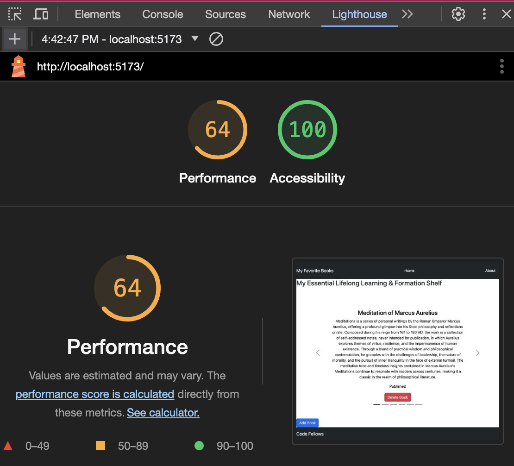

# Can-of-Books Backend

**Author**: Drew Stroede
**Version**: 1.0.0

## Overview

This applicationis the backend version of Can-of-Books-Frontend. All change logs and app creation information will be displayed on that Read-Me file.

## Getting Started

## Architecture

This app features MongoDB, React, Javascript, Bootstrap, and Vite.

## Lighthouse

## Change Log

Started Dec 2, 2023
Finished with add and delete buttons Dec 13, 2023

## Credit and Collaborations

Credit to Code Fellows

## Name of feature: Populating Carousel

Estimate of time needed to complete: 1hr

Start time: 4:05pm

Finish time: 4:35pm

Actual time needed to complete: 30 min

## Name of feature: Adding Books

Estimate of time needed to complete: 1hr

Start time: 9am

Finish time: 11:35am

Actual time needed to complete: 2hrs 35min

## Name of feature: Deleting Books

Estimate of time needed to complete: 45 min

Start time: 3:30pm

Finish time: 4:50pm

Actual time needed to complete: 15 min
